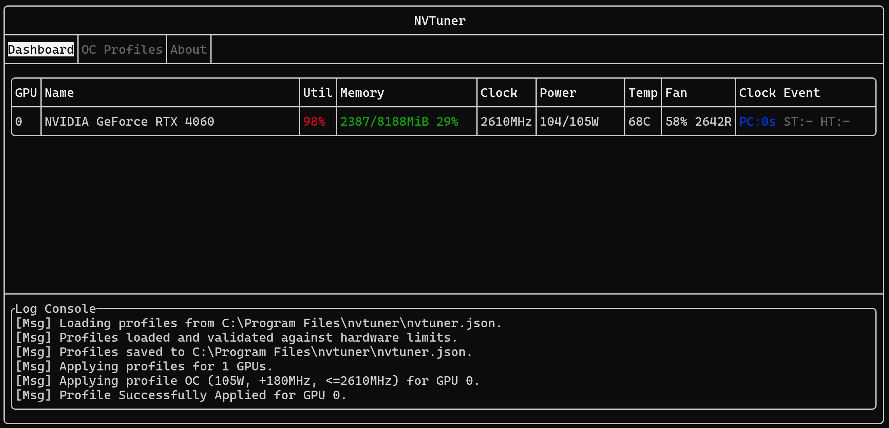
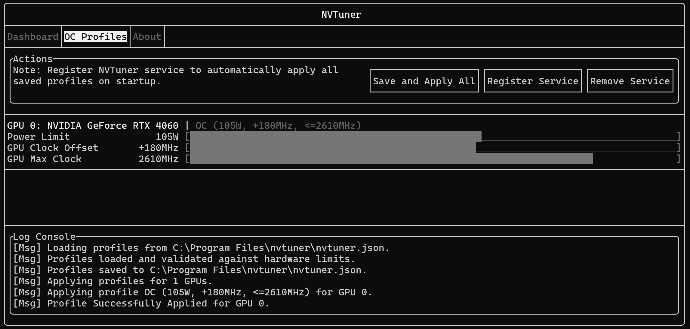

# NVTuner

[](https://opensource.org/licenses/MIT)
[](https://github.com/zhhc99/nvtuner)

[README](./README.md) | [中文文档](./README_zh.md)

一个轻量级的, 基于终端的 NVIDIA GPU 监控和调整工具.





## 为什么使用 NVTuner?

我希望 NVTuner 是您以下需求的助手:

- 监控性能指标, 找到限制性能的原因
- 只需简单配置, 即可降压超频, 或调整功耗
- 将配置保存, 每次开机登录时自动应用
- 不想安装复杂的软件包

NVTuner 是很轻量的工具, 无需后台留存. 它本身使用 NVIDIA **原生接口**, 并且**跨平台**支持 Windows / Linux. 它的 GUI 基于终端, 这也方便您在远程会话中使用它.

关于使用 NVTuner 进行 GPU 超频的具体方式, 可以参见 [简易超频手册](./docs/easy-oc-guide.md).

> ⚠️ 免责声明: 超频和修改 GPU 设置存在风险. 这可能导致系统不稳定, 或在极少数情况下损坏您 (或远程计算机) 的硬件. 您需要对使用本软件所采取的任何行为负全部责任.

## 系统要求

- **硬件**: NVIDIA GPU, 建议至少是 Pascal 架构 (如 GTX 1060, 它于 2016 年发售).
- **驱动**: 推荐使用 NVIDIA 565 或更新版本的驱动以获得完整功能支持. 旧版驱动可能导致功能受限或软件出现意外错误.

## 快速开始

1. **下载:** 从 [Release 页面](https://github.com/zhhc99/nvtuner/releases) 下载最新版本.
2. **Windows:** 将可执行文件解压到任意空文件夹 (如 `C:/Software/nvtuner`), 以管理员身份运行 `nvtuner.exe`.
3. **Linux:** 用您的包管理器进行安装, 然后执行 `sudo nvtuner`.

## 从源码编译

- **编译工具**:
  - **Windows**: Visual Studio 2019 (MSVC) 或更高版本.
  - **Linux**: 一个兼容 C++17 的编译器 (如 GCC/Clang) 和 `make`.
  - CMake 3.15+
- **依赖**:
  - NVIDIA Management Library (NVML). 它一般随 CUDA 的安装而获得.
  - [FTXUI](https://github.com/ArthurSonzogni/FTXUI/)
  - [nlohmann-json](https://github.com/nlohmann/json)

> **关于 NVML 的说明**: 为获得完整功能, 建议使用 NVML v13+ API 进行编译. 使用较旧版本编译时, 有可能编译成功, 但软件功能会受到限制.

### Windows

```bash
git clone https://github.com/zhhc99/nvtuner.git
cd nvtuner

mkdir build
cd build
cmake ..
cmake --build . --config Release
```

### Linux

```bash
git clone https://github.com/zhhc99/nvtuner.git
cd nvtuner

mkdir build
cd build
cmake ..
make -j$(nproc)

cpack # for packaging
```

## 注意事项

### 使用须知

在使用 NVTuner 时:

- **Windows 用户**:
  - 监控功能无需管理员权限, 但要调整 GPU 设置则需管理员权限运行.
  - 配置文件位于 `nvtuner.exe` 相同目录下.
  - 若**移动了程序**, 您需要重新在应用内执行 `Register Service`, 才能使服务正确生效.
  - **卸载应用**: 以管理员权限启动 `nvtuner.exe`, 执行 `OC Profiles` 下的 `Remove Service`, 然后删除所有文件即可.
- **Linux 用户**:
  - 请以 `root` 权限运行: `sudo nvtuner`.
  - 配置文件位于 `/etc/nvtuner/`.
  - 用你的包管理器安装和卸载程序. 卸载时, 服务会被自动清除.
  - 对于多数用户, 建议启用 `nvidia-persistenced` 服务: `sudo systemctl enable --now nvidia-persistenced`. 该服务应该随驱动而安装. 简单来说, 若该服务未启用, 您的 GPU 配置可能会在空闲时自动重置.

### 已知问题与限制

- 使用鼠标拖动滑块时无法按步进值 15MHz 调整. 可以使用方向键进行精确调节. (这是上游 `FTXUI` 的限制)
- Linux 支持在 Fedora 42 进行测试, 其他发行版尚未支持.

发现 Bug? [欢迎提交 issue!](https://github.com/zhhc99/nvtuner/issues)

## 相关工具

- **MSI Afterburner**: 适用于 Windows 的 GPU 超频工具, 支持各种深度配置.
- **HWiNFO64**: 图形工具, 监控各硬件的状态.
- **OCBASE/OCCT**: 专业的压力测试工具, 可用于测试超频是否稳定.
- **nvtop / nvitop**: 基于终端的 GPU 监控工具.
- **nvidia-settings**: 适用于 Linux 的显卡配置工具, 来自 NVIDIA 官方.
