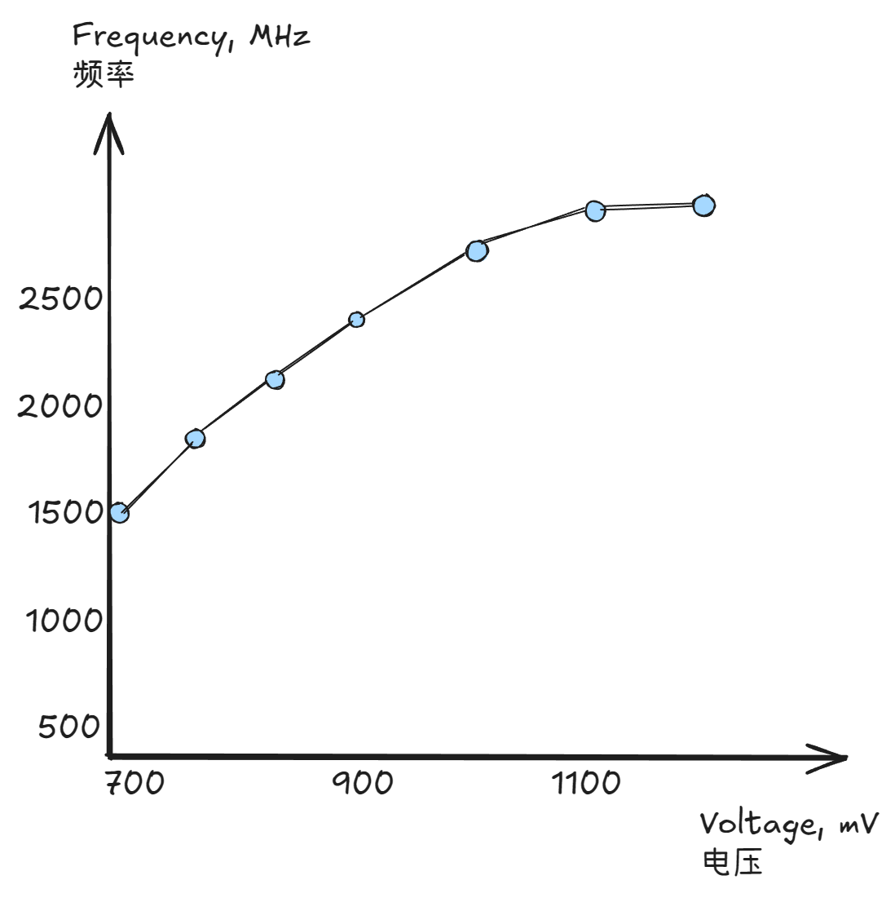
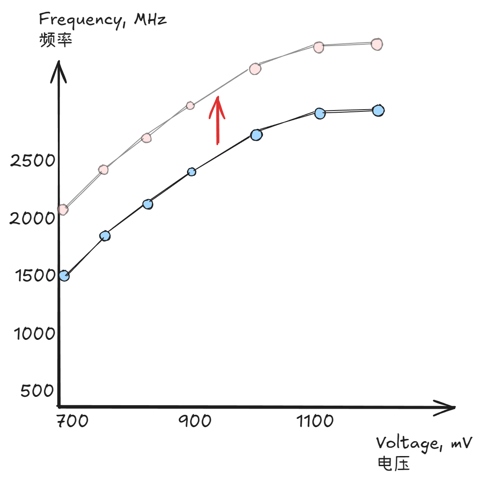
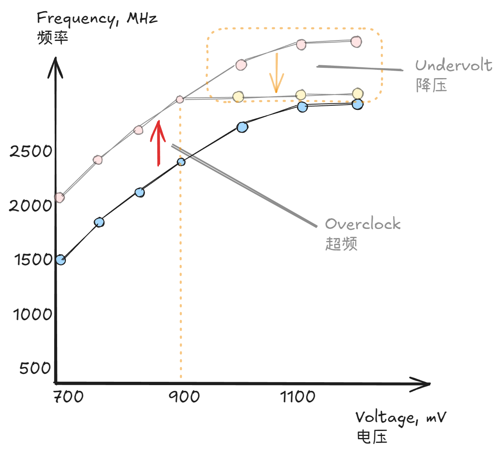

# 简易超频手册

该手册旨在帮助用户理解现代 GPU 降压超频的基本原理, 并指导您如何使用 NVTuner 安全, 简便地降低显卡功耗或提升性能.

> ⚠️ 免责声明: 超频和修改 GPU 设置存在风险. 这可能导致系统不稳定, 或在极少数情况下损坏您 (或远程计算机) 的硬件. 您需要对使用本软件所采取的任何行为负全部责任.

## 降压超频的好处

- 超频: 相同电压下, 让 GPU 在高于出厂 V-F 曲线的频率下运行, 以追求更高的性能.
- 降压: 超频后限制显卡的最高工作频率, 以使得相同频率下的电压低于出厂值. 它本身不直接提升性能, 但能降低功耗和温度, 让性能表现更稳定.

> V-F 曲线: 即电压-频率曲线. NVIDIA GPU 在出厂时有一个预设的默认值, 它控制了显卡在固定电压下的频率. 频率越高, 性能就越强; 功耗正比于 `频率×电压×电压`. 后文有一张 V-F 曲线的示意图.

## 如何用 NVTuner 降压超频

在 Afterburner 这类软件里, 降压超频通过编辑 V-F 曲线实现.

超频是将 v-f 曲线 "上提":

降压超频是将 v-f 曲线的后端 "拉平", 让电压在某个位置截断:

在 NVTuner 里, 实现这样的编辑很简单. 以管理员启动 NVTuner, 导航到 `OC Profile` 页面, 找到自己的 GPU:

- 令 `GPU Clock Offset` = `V-F 曲线的上移量`;
- 令 `GPU Max Clock` = `V-F 曲线的最高频率`;
- 执行 `Save and Apply All`.

这样就好了, 就这么简单. 超频参数会保存到可执行文件目录下的 `nvtuner.json`.

现在您只需为自己的显卡寻找一组合适的参数.

- **论坛或社区可以提供帮助**: 搜索同型号显卡的超频结果, 使用较为温和的一组参数 (然后进行可能的微调).
- **其他人的参数可能不适合您**: 即便型号相同, 每张显卡的体质也不同. 不要盲目使用他人的激进参数.
- **极限超频需要大量测试**: 如果需要极限超频, 请确保经过充分测试, 确保显卡稳定.

## 登录时自动超频

每次重启计算机, 超频配置将被自动重置. 当您**确保超频结果稳定**后, 可以执行 `Register Service`. 这会创建一个计划任务 (Windows) 或 systemd 服务 (Linux), 从而在用户登录时自动应用 `nvtuner.json` 内的超频参数.

如果您意外保存了不稳定的结果导致无法正常进入系统 (一般不太会这样), 手动删除 `nvtuner.json` 即可重置配置.

> 在 Windows 下, 配置文件于 `nvtuner.exe` 所在的目录生成. 您可能需要以安全模式启动系统, 找到文件并删除.
>
> 在 Linux 下, 配置文件位于 `/etc/nvtuner`. 您可以用 `Ctrl+Alt+F2` (或 `F3`, `F4`, `F5`) 进入 TTY, 然后删除文件.
